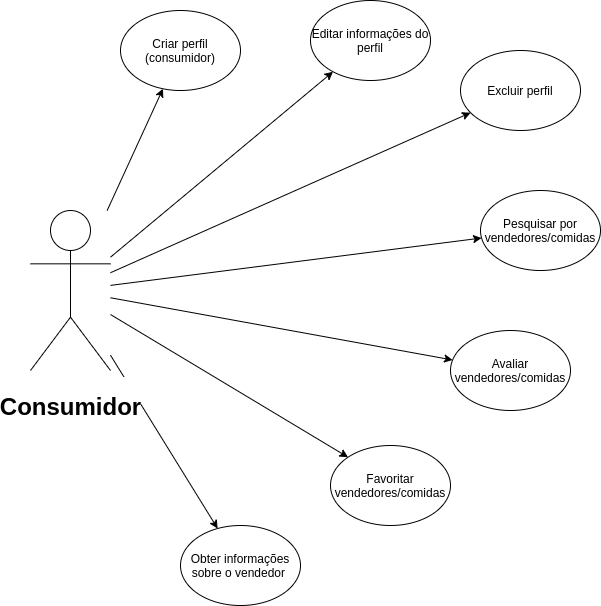
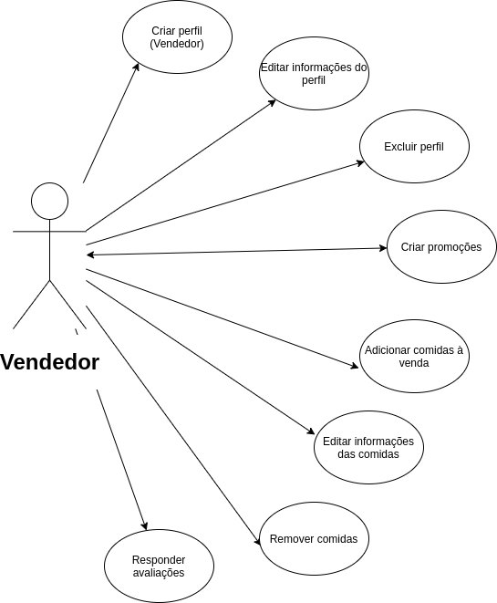
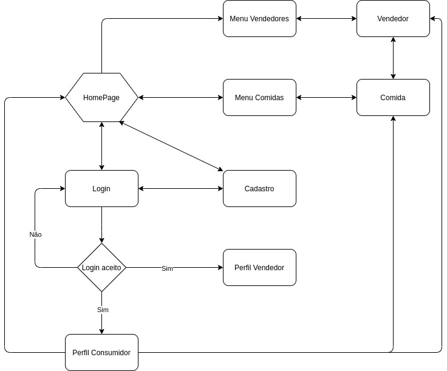

# HotFood
HotFood é um projeto da disciplina Introdução ao Desenvolvimento Web (SSC0219), com a professora Kamila, em que foi feito um website de divulgação de comidas para pequenos e médios comerciantes.

## Membros
João Ricardo Minoru Nagasava
Gustavo Tuani Mastrobuono
Victor Graciano de Souza Correia

## Motivação

Inicialmente motivado pelos universitários que vendem comidas caseiras, o HotFood surgiu com a ideia de facilitar a divulgação dos produtos de comerciantes menores. Dessa forma, a conexão entre consumidores e vendedores se fortalece. 

## Funcionalidades
O site dispõe-se de dois tipos de usuários: consumidor e vendedor. Os dois possuem diferentes finalidades com o site - o consumidor deseja encontrar algo para comer e o vendedor quer comerciliazar sua comida - que portanto possuem diferentes funcionalidades: 

#### Consumidor

#### Vendedor

## Fluxograma do site
O diagrama abaixo mostra o fluxo de páginas do site e logo abaixo a descrição de cada página.

#### HomePage
Página com opção de verificar novas promoções, comidas e vendedores. No fim da página existe um espaço "Sobre nós" o qual conta a nossa missão, cultura e valores. 
#### Login
Área de login (consumidor ou vendedor). Para fazer login será necessário o e-mail e senha do usuário. Caso o usuário não tenha feito um cadastro, ele terá opção de efetuar um novo cadastro (link para a página de cadastro) que ficará abaixo da área de login.
#### Cadastro
Espaço onde será preenchido todas as informações do usuário. Para consumidores, as informações serão: nome, telefone, endereço, e-mail e senha. E para vendedores: nome, descrição, endereço, telefone, e-mail, contato e senha.
#### Perfil Consumidor
Nesta parte mostrará os venderores e comidas favoritas, bem como sugestões de comida e promoção. Será possível editar as informações da conta, excluir conta e fazer logoff. Por fim, haverá uma aba para histórico de avaliações.
#### Perfil Vendedor
O vendedor poderá editar suas informações, excluir conta, fazer logoff, adicionar e remover comidas bem como editar informações da comida. Assim como o consumidor, haverá uma aba para histórico de avaliações.
#### Menu Comidas
Listagem das comidas, que podem ser filtradas por categoria, relevância, promoção, preço e distância. Caso o consumidor não tenha logado, será necessário obter o seu endereço.
#### Menu Vendedores
Listagem dos vendedores, que podem ser filtrados por categoria, relevância e distância. Caso o consumidor não tenha logado, será necessário obter o seu endereço.
#### Comida
Informações da comida: vendedor da comida, descrição, ingredientes, contato e local de venda. Haverá a possibilidade do consumidor avaliar a comida (com uma nota e/ou comentário)
#### Vendedor
Informações do vendedor: descrição do vendedor, contato, local de venda e comidas feitas pelo vendedor. Haverá a possibilidade do consumidor avaliar o vendedor (com uma nota e/ou comentário)